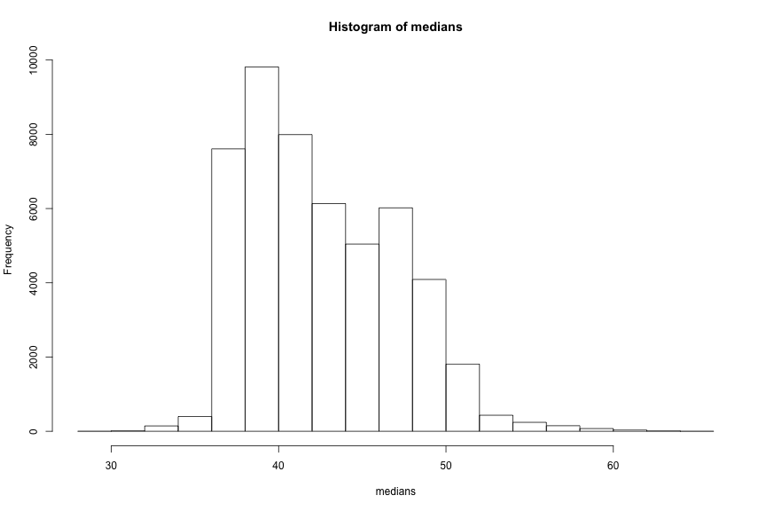
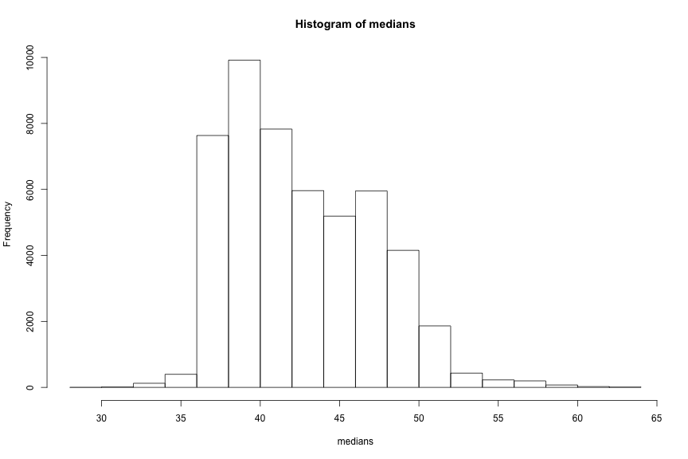

RRUG - Going Parallel
========================================================
author: Matt McAnear
date: 2016-05-12
autosize: true


About Me
========================================================

- In Reno for ~1 year
- Math, Econ, and social science background
- I like R quite a bit.
- Focus on software architecture as a Data Scientist

About Clear Capital
==================================================
* AMC once based in Truckee, now in Reno
* Appraisals, Public Records, MLS Data; uniquely complete dataset for home prices
* Data Science team of 7 - looking for an eighth (Stat Analyst)


Outline
========================================================

- Parallel Intro
- Forks
- PSOCK
- Clusters


Simplest Example
========================================================


```r
exampleData <- runif(100, min = 0, max = 100)
median(exampleData)
```

```
[1] 55.09117
```

Is the median accurate?
==================================================


```r
system.time(
    medians <- replicate(n = 50000, expr = {
        subSample <- sample(exampleData, size = length(exampleData), replace = TRUE)
        sampleMedian <- median(subSample)
    }, simplify = TRUE)
)
```

```
   user  system elapsed 
  1.913   0.039   1.981 
```

Resulting Distribution
==================================================




Is the median accurate? - Parallel Edition
==================================================


```r
library(parallel)
system.time(
    medians <- mclapply(1:50000, function(run) {
        subSample <- sample(exampleData, size = length(exampleData), replace = TRUE)
        sampleMedian <- median(subSample)
    }, mc.cores = 4, mc.preschedule = TRUE)
)
```

```
   user  system elapsed 
  2.118   0.151   0.905 
```

Same Distribution!
==================================================



What Happened?
==================================================
- \code{mclapply} creates multiple processes for R and then returns the results
- Access to all the objects the parent process has access to, including global variables.

Fork Clusters
==================================================

```r
cl <- makeForkCluster(nnodes = 4)
system.time(
    medians <- parLapply(cl = cl, X = 1:50000, function(run) {
        subSample <- sample(exampleData, size = length(exampleData), replace = TRUE)
        sampleMedian <- median(subSample)
    })
)
```

```
   user  system elapsed 
  0.021   0.004   0.870 
```

```r
stopCluster(cl)
```


Fork Clusters in a Nutshell
==================================================
* Very similar to just using mclapply
* Can't use `mclapply` within a cluster!
* Zombie processes...


The (P)Sock Cluster
==================================================
* Not all of the "nodes" have to be one server!
* You have to export all the variables you want to use to the threads


Split Strategy 1 - Create Cluster Across All your Cores
==================================================
* Does not have to be one machine (Advantage over Fork)
* Must copy data across machines - potentially a lot of overhead
* Maximum of 128 "nodes", i.e. 128 cores in a single cluster with PSOCK!


Split Strategy 2 - The Mini-Me Cluster
==================================================
* Divide the work into reasonable chunks and assign each chunk a key
* Create a cluster with 1 node on each server.
* On each parent process spawned by this cluster, create **n** child processes,
where **n** is the number of cores on the box (`detectCores()`).
* Copy the original data between each box with a key pairing
* ClusterApplyLB over the keys - each box runs childs processes controlled by a single master process


Why use the second split strategy?
==================================================

- **128 node limit only applies to a single cluster object!**
- As long as you have less than 128 servers, you *should* be good.


Extended Clear Capital Example
==================================================


